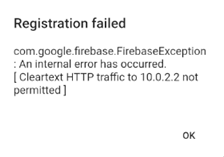

## Contents- [Contents](#contents)
- [Introduction](#introduction)
  - [What is Firebase Emulator Suite?](#what-is-firebase-emulator-suite)
- [Installation](#installation)
- [Using Emulators in Flutter](#using-emulators-in-flutter)
- [How To](#how-to)
- [References](#references)

## Introduction

A concise document on setting up the Firebase Emulator Suite for use in a Flutter project.

### What is Firebase Emulator Suite?

The Firebase Local Emulator Suite is a set of advanced tools for developers looking to build and test apps locally using Cloud Firestore, Realtime Database, Cloud Storage, Authentication, Cloud Functions, Pub/Sub, and Firebase Hosting. It provides a rich user interface to help you get running and prototyping quickly.

## Installation

Refer to the [Install, configure and integarte Local Emulator Suite](https://firebase.google.com/docs/emulator-suite/install_and_configure).

I checked my node version number:

```cmd
node --version
```

Although I was on v8.11.3 I decided to update it as the latest recommended version was 14.18.0 LTS. I downloaded it from [node.js](https://nodejs.org/en/) and the install was straight forward although it did nstall lots of software it needed.

I checked my java version:

```cmd
java --version
```

I was on openjdk 13.0.2 2020-01-14. I decided that was new enough and didn't upgrade.

I checked my Firebase CLI version:

```cmd
firebase --version
```

I got the error 'firebase' is not recognized as an internal or extrnal command. So I went to [Install the Firebase CLI](https://firebase.google.com/docs/cli#install_the_firebase_cli) and followed the Windows instructions for using the npm option:

```cmd
npm install -g firebase-tools
```

It installed fine.

I then authenticated with my Google account using:

```cmd
firebase login
```

Once I was authenticated I listed my Firebase projects using:

```cmd
firebase projects:list
```

Then I went to the terminal in VS Code for my project to initialise the current working directory as a Firebase project. I was in directory `c:\projects\sea_service`:

```cmd
firebase init
```

First it told me I was outside my home directory and asked if I wanted to proceed. I said 'Y' and it proceeded.

Then it wanted to associate a Firebase project with this directory. I used an existing project from the list above.

Then I accepted the default files for Firestore Rules and Firestore indexes.

Under Emulators setup I selected the auth emulator and the firestore emulator. To select them I used the up and down arrows to get to them and space bar to select them. Once I had both selected I pressed enter.

I aceepted the default port both of them, enabled the Emulator UI using the default port and downloaded the emulators.

Once the initialisation was complete I tried to connect to the emulators:

```cmd
curl localhost:4400/emulators
```
 and got the message curl: (7) Failed to connect to localhost port 4400: Connection refused.

Then from the project directory I started the emulators:

```cmd
firebase emulators:start
```
The ui was downloaded and the emulators were started.

I then went to the browser to page `http://localhost:4000` and the emulator ui displayed.

## Using Emulators in Flutter

To connect my app to the Firebase Emulators I need to edit the main.dart file:

I added statements to use the emulators:
```dart
    await FirebaseAuth.instance.useEmulator('http://localhost:9099');
    FirebaseFirestore.instance.useFirestoreEmulator('localhost', 8080);
```

So my main.dart looks like:

```dart
bool _useFlutterEmulator = false;

Future<void> main() async {
  WidgetsFlutterBinding.ensureInitialized();
  await Firebase.initializeApp();

  if (_useFlutterEmulator) {
    await FirebaseAuth.instance.useEmulator('http://localhost:9099');
    FirebaseFirestore.instance.useFirestoreEmulator('localhost', 8080);
  }

  final sharedPreferences = await SharedPreferences.getInstance();
  runApp(ProviderScope(
```

When I first ran the app on an android emulator after updating to use the Firebase Emulator Suite I got the error:



To fix this I edited `android/app/src/debug/AndroidManifest.xml` adding:

```xml
<application android:usesCleartextTraffic="true">
  <!-- possibly other elements -->
</application>
```

so I ended up with

```xml
<manifest xmlns:android="http://schemas.android.com/apk/res/android"
    package="com.example.sea_service">
    <!-- Flutter needs it to communicate with the running application
         to allow setting breakpoints, to provide hot reload, etc.
    -->
    <uses-permission android:name="android.permission.INTERNET"/>
    <application android:usesCleartextTraffic="true">
    <!-- possibly other elements -->
    </application>
</manifest>
```

I stopped the app, deleted it off the phone and built it again and all worked fine.

## How To

## References

* [Emulator Suite](https://firebase.google.com/docs/emulator-suite)
